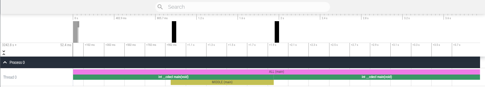

# ChrTrcProfile
A profiling library for timing functions adn scopes, and output them into a json format, readable by the [chrome://tracing](chrome://tracing) ([new version](https://ui.perfetto.dev/)) developer tool.

## Workflow

A program will start the profiler session by specifying the size of the profiler buffer and optionally a timeout. Inorder to minimize the performance hit of the profiler itself during profiling, the profiling data is stored in memory and is only parsed and written once the session is finished. Due to this, the program can take a hit on performance once the profiling session is ended, however, this is not recorded in the profiling data itself.  
  
The profiler only profiles functions specified by the user. For quick ways of profiling a function or scope, see the [Macros](#Macros) section.

## Recording data

A function or scope can be timed with a ScopedTimer class. The ScopedTimer takes the name and category the timing data should be tied to, this is normally the function name.  
> ScopedTimer(name, category);

A timer is stopped once it is destructed, so a ScopedTimer, if placed at the top of a function / scope, will automaticly profile the entire scope and send the data to the profiler, if a session is active.  
Optionally a timer can be stopped manually using the stop() function.

#### IMPORTANT

The strings passed to name and category should always be string literals and not be generated at runtime!

## Sessions

A session is started with the beginSession function.
> CTProfiler::beginSession(buff_size, file_out, append_date, timeout);

The buff size and file_out must be passed, the rest of the arguments are optional.

If a ScopedTimer checks if a session is active at the end of its lifetime, meaning a ScopedTimer is still valid if it was created before a beginSession, as long as it ends while an session is active.

A session is ended when an endSession function is called or when a user specified timeout is hit or when the buffer is full.
> CTProfiler::endSession();

When endSession is called, the  data is parsed and saved to the json file specified in the beginSession call.

## Verbosity

The profiler can have a verbosity set, that allows the user to filter out functions depending on their specified verbosity.
> CTProfiler::setVerbosity()

A ScopedTimer can have the verbosity specified by a template parameter
> ScopedTimer\<verbosity>();

Any ScopedTimer with a verbosity greater than the current verbosity (except if its 0, then everything is recorded) will be ignored.

## Macros

Use the CT_MEASURE macro to setup a ScopedTimer for a scope.
The CT_MEASURE function automaticly sets the name of the ScopedTimer to be the function signature of the current scope. The category is empty.

Additional prefixes can be added

>_C = custom category  
>_N = custom name  
>_NC = custom name and cateogry  
>_V = custom verbosity  
>_VC = custom verbosity and category  
>_VN = custom verbosity and name  
>_VCN = custom verbosity, name, and category  

If the macro contains N as a prefix, the name is generated as follows
> passed_name (function_name)

## Example
A quick example of how a program might look like.

```CPP
#include "ChrTrcProfiler.h"
#include "ChrTrcMacros.h"

using namespace ChrTrcProfiler;
using namespace std::chrono_literals;

int main()
{
    CTProfiler::beginSession(sizeof(profiledFunction) * 4, "Profile.json");
    {
        CT_MEASURE_N("ALL");

        // A section
        {
            CT_MEASURE_C("A");

            std::this_thread::sleep_for(1s);

            CT_MEASURE_NC("MIDDLE", "A");

            std::this_thread::sleep_for(1s);

        }
        // B section
        {
            CT_MEASURE_C("B");

            std::this_thread::sleep_for(2s);

            // session is ended here, as the buffer is full at this point
        }
    }
    CTProfiler::endSession(); // technically no need for this
}
```

### Result



## Building

this library uses the cmake build system, with no optional macros.
thus, it should enough to create a build directory and simply call cmake generate and build.
> mkdir build && cd build && cmake build ..
